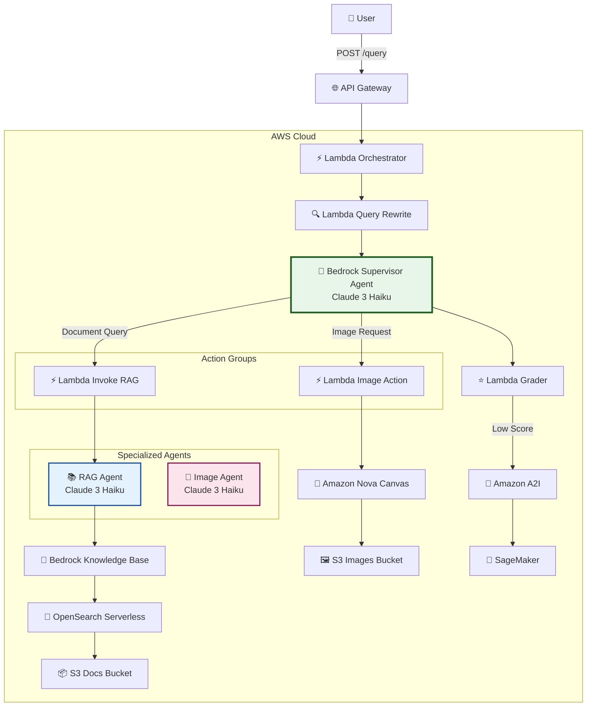

# AWS Bedrock Multi-Agent Orchestration

Production-ready multi-agent system using AWS Bedrock Agents with custom delegation, RAG (Retrieval Augmented Generation), and image generation capabilities. Built with pure AWS services and Terraform.

## 🏗️ Architecture



### Flow Description

1. **User Query** → API Gateway → Orchestrator Lambda
2. **Query Rewrite** → Claude Haiku optimizes the query
3. **Supervisor Agent** → Analyzes query and decides:
   - **Document query?** → Calls `search_documents` action → Invokes RAG Agent
   - **Image request?** → Calls `generate_image` action → Generates with Nova Canvas
   - **General question?** → Responds directly
4. **Grader** → Evaluates response quality (1-5 score)
5. **A2I** → Human review if quality is low (optional)

## ✨ Key Features

- ✅ **Multi-Agent Orchestration** - Supervisor coordinates specialized agents
- ✅ **Custom Delegation** - Action Groups enable seamless inter-agent communication
- ✅ **RAG with Citations** - Knowledge Base provides sourced, accurate answers
- ✅ **Image Generation** - Amazon Nova Canvas creates images from text descriptions
- ✅ **Query Enhancement** - Automatic query rewriting for better results
- ✅ **Quality Grading** - Automated response evaluation
- ✅ **Infrastructure as Code** - Complete Terraform deployment
- ✅ **Serverless** - No servers to manage, scales automatically

## 🛠️ Technology Stack

| Component | AWS Service | Purpose |
|-----------|-------------|---------|
| **Agent Orchestration** | Bedrock Agents (Claude 3 Haiku) | Supervisor + RAG + Image agents |
| **Delegation** | Action Groups + Lambda | Custom inter-agent communication |
| **Vector Database** | OpenSearch Serverless | Semantic search with embeddings |
| **Embeddings** | Titan Embed Text v2 | Document vectorization |
| **Image Generation** | Amazon Nova Canvas | Text-to-image generation |
| **Query Processing** | Lambda + Claude Haiku | Query rewrite & response grading |
| **Human Review** | Amazon A2I + SageMaker | Quality assurance workflow |
| **Storage** | S3 | Documents & generated images |
| **API** | API Gateway | HTTP endpoint |
| **Infrastructure** | Terraform | IaC deployment |

## 📋 Prerequisites

- **AWS CLI** configured (`aws configure`)
- **Terraform** ≥ 1.5
- **Python** ≥ 3.11
- **Bedrock Model Access** in your region (eu-west-1 recommended):
  - ✅ `anthropic.claude-3-haiku-20240307-v1:0`
  - ✅ `amazon.titan-embed-text-v2:0`
  - ✅ `amazon.nova-canvas-v1:0`

> **Note:** Request model access in AWS Console → Bedrock → Model access

## 🚀 Quick Start

### 1. Clone Repository

```bash
git clone https://github.com/romanceresnak/aws-bedrock-multi-agent.git
cd aws-bedrock-multi-agent
```

### 2. Install Dependencies

```bash
pip install -r requirements.txt
```

### 3. Deploy Infrastructure

```bash
cd terraform
terraform init
terraform apply -auto-approve
cd ..
```

Copy the Terraform outputs to use in next steps.

### 4. Create Bedrock Resources

Run setup scripts in order:

```bash
# 1. Create Knowledge Base with OpenSearch
python scripts/01_create_knowledge_base.py

# 2. Create RAG and Image agents
python scripts/02_create_subagents.py

# 3. Create Supervisor agent
python scripts/03_create_supervisor.py

# 4. Add document search delegation
python scripts/add_supervisor_action_group.py

# 5. Add image generation delegation
python scripts/add_image_action_group.py
```

Each script updates the `.env` file with created resource IDs.

### 5. Upload Documents

```bash
# Upload your documents to S3
aws s3 cp your-documents/ s3://multi-agent-bedrock-dev-docs-<account-id>/reports/ --recursive

# Sync Knowledge Base (re-index)
python scripts/01_create_knowledge_base.py --sync
```

### 6. Test the System

**Test in AWS Console:**
1. Go to Bedrock → Agents → `multi-agent-supervisor-v2`
2. Click **Test** (top right)
3. Try queries:
   - `"What is our remote work policy?"` → RAG delegation
   - `"Generate an image of a sunset"` → Image generation
   - `"Hello, how are you?"` → Direct response

**Test via API:**
```bash
curl -X POST https://<your-api-gateway-url>/query \
  -H "Content-Type: application/json" \
  -d '{"query": "What is our remote work policy?"}'
```

## 📂 Project Structure

```
aws-bedrock-multi-agent/
├── README.md                    # This file
├── requirements.txt             # Python dependencies
├── .gitignore                   # Git ignore rules
│
├── lambda/                      # Lambda function handlers
│   ├── orchestrator/handler.py       # Main entry point (API Gateway)
│   ├── query_rewrite/handler.py      # Query optimization
│   ├── grader/handler.py             # Response quality scoring
│   ├── invoke_rag_agent/handler.py   # RAG delegation bridge
│   └── image_generation_action/handler.py  # Image generation + S3
│
├── scripts/                     # Setup & deployment scripts
│   ├── 01_create_knowledge_base.py   # Create KB + OpenSearch
│   ├── 02_create_subagents.py        # Create RAG & Image agents
│   ├── 03_create_supervisor.py       # Create Supervisor agent
│   ├── add_supervisor_action_group.py  # Add document search delegation
│   └── add_image_action_group.py     # Add image generation delegation
│
└── terraform/                   # Infrastructure as Code
    ├── main.tf                  # Main configuration
    ├── variables.tf             # Input variables
    ├── outputs.tf               # Output values
    ├── iam.tf                   # IAM roles & policies
    ├── s3.tf                    # S3 buckets
    ├── opensearch.tf            # OpenSearch Serverless
    └── lambdas.tf               # Lambda functions + API Gateway
```

## 🎯 How It Works

### Document Search Flow

1. User asks: `"What is our remote work policy?"`
2. Supervisor Agent analyzes query type
3. Calls `search_documents` action group
4. Lambda invokes RAG Agent
5. RAG Agent queries Knowledge Base
6. OpenSearch performs semantic search
7. Returns answer with citations
8. Supervisor presents to user

### Image Generation Flow

1. User asks: `"Generate an image of a sunset"`
2. Supervisor Agent recognizes image request
3. Calls `generate_image` action group
4. Lambda invokes Nova Canvas
5. Image generated and uploaded to S3
6. Presigned URL returned to user
7. Supervisor presents URL to user

### Direct Response Flow

1. User asks: `"Hello, how are you?"`
2. Supervisor recognizes general query
3. Responds directly without delegation

## 💰 Cost Estimation

Monthly costs for **low-moderate usage** (based on eu-west-1 pricing):

| Service | Cost | Notes |
|---------|------|-------|
| **OpenSearch Serverless** | ~$350/month | 2 OCUs minimum (biggest cost) |
| **Bedrock Invocations** | ~$5-20/month | Pay per token (Claude Haiku is cheap) |
| **Lambda** | <$1/month | Free tier covers most usage |
| **S3 Storage** | <$1/month | Minimal storage |
| **API Gateway** | <$1/month | HTTP API pricing |
| **Nova Canvas** | $0.04/image | Pay per image generated |
| **A2I** | Variable | Only if human review used |

**Total: ~$360-380/month** (OpenSearch is 95% of cost)

> **Cost Optimization:** Consider deleting OpenSearch collection when not in use. Re-indexing takes <5 minutes.

## 🧹 Cleanup

To delete all resources and stop incurring costs:

```bash
# 1. Delete Bedrock agents & Knowledge Base
python scripts/destroy_all.py

# 2. Destroy infrastructure
cd terraform
terraform destroy -auto-approve
```

This removes all billable resources. You can always redeploy using the same code.

## 🔒 Security

- ✅ **IAM Roles** - Least privilege access for all components
- ✅ **Encryption** - S3 and OpenSearch encrypted at rest
- ✅ **VPC Isolation** - OpenSearch in VPC (via security policies)
- ✅ **API Gateway** - HTTPS only
- ✅ **Resource Policies** - Explicit permissions on S3 and OpenSearch
- ✅ **CloudWatch Logs** - Full audit trail of all operations

## 📊 Monitoring

All components write logs to CloudWatch:

```bash
# View Lambda logs
aws logs tail /aws/lambda/multi-agent-bedrock-dev-orchestrator --follow

# View agent traces (includes delegation calls)
# Available in Bedrock Console → Agents → Test → Trace tab
```

## 🤝 Contributing

This is a reference implementation. Feel free to:
- Fork and modify for your use case
- Add new specialized agents
- Integrate with other AWS services
- Submit issues for bugs or questions

## 📄 License

MIT License - See LICENSE file for details

## 🙏 Acknowledgments

Built with:
- [AWS Bedrock](https://aws.amazon.com/bedrock/) - Foundation models and agents
- [Terraform](https://www.terraform.io/) - Infrastructure as Code
- [boto3](https://boto3.amazonaws.com/v1/documentation/api/latest/index.html) - AWS SDK for Python

---

**Questions?** Open an issue or check the detailed architecture in [ARCHITECTURE.md](ARCHITECTURE.md)
